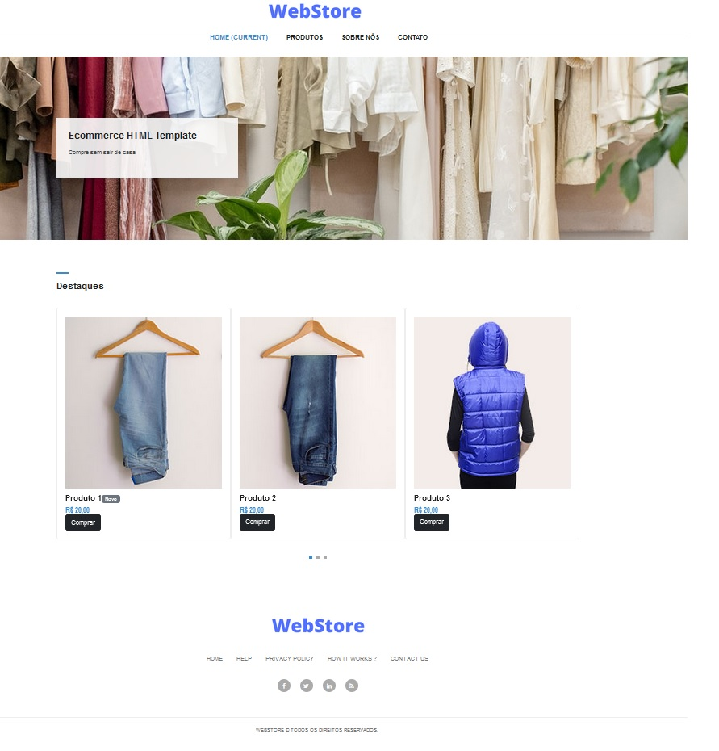
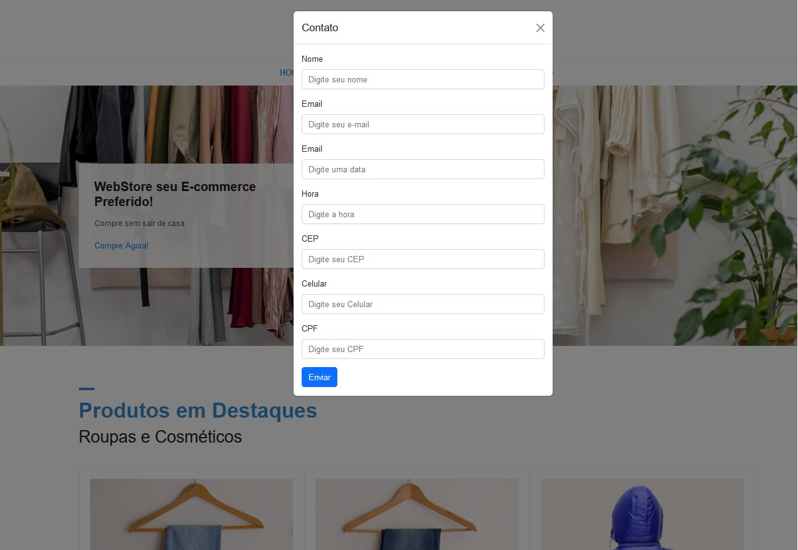

## 📝 Projeto Webstore E-commerce
Projeto de criação e um e-commerce utilizando as bibliotecas bootstrap e jQuery, com os conhecimentos passados no modulo jquery do cruso de desenvolvedor full-stack da EBAC.
---

## 💻 Screenshot do projeto
---

Designer 01

Designer 02

<h4 align="center"><a href="https://630747886b1c0400b003d92f--frolicking-eclair-0fa201.netlify.app/">Clique aqui e visite o projeto</a></h4>

---

## 📚 Seções

O site é composto pelas seguintes funcionalidades:

- **Home:** Nele temos um menu de navegação onde podemos abrir modals para sobre nós e contato;
- **Modal:** Nestes modals é possivel visualizar informações sobre o site e abrir um formulario de cadastro;
- **Produtos:** Nesta seção o usuário pode navegar pelos produtos e alterar as páginas para visualizar outros produtos;
- **Receba Novidades:** Nesta seção o usuário pode cadastrar seu e-mail para receber newsletter sobre novos produtos;
- **Footer:** No footer o usuário pode ter a opção de navegar sobre as seções e visualizar informações do criador do site;

---

## 💼 Tecnologias utilizadas

Para o desenvolvimento deste site utilizei as seguintes tecnologias:

- HTML;
- CSS;
- JavaScript;
- Bootstrap;
- jQuery;

---

## 🙋🏻‍♂️ Autor

Bruno Oliveira

---
